---

layout: default

---

# &nbsp;

## **{{ site.presentation.title }}** {#cover}

	
{{ site.author.name }}

## Инструменты

  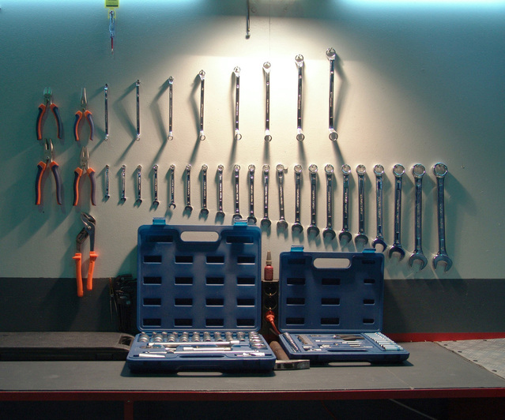

## Джентльменский набор

  * Удобный редактор или IDE, тысячи их
  * VCS: Git, Mercurial, <s>svn</s>
  * Терминал
  * Статический анализ:
    * JavaScript: ESLint, JSHint, JSCS
    * CSS: stylelint, CSSComb
  * Инструменты разработчика в браузерах
  * Инструменты для работы с графикой

## Мобильная специфика

Всё как 10 лет назад:

  * Плохие сети
  * Cлабое железо
  * Нет удобств для разработчика

## Повестка дня

  * Как разрабатывать без мобильного?
  * Как пробросить проект в устройство?
  * Как пробраться в мобильный браузер?
  * Что, если нужно устройство, но его не найти?

## &nbsp;
{:.section}

### Как разрабатывать без мобильного?

## Chromium
{:.screen-shot}

  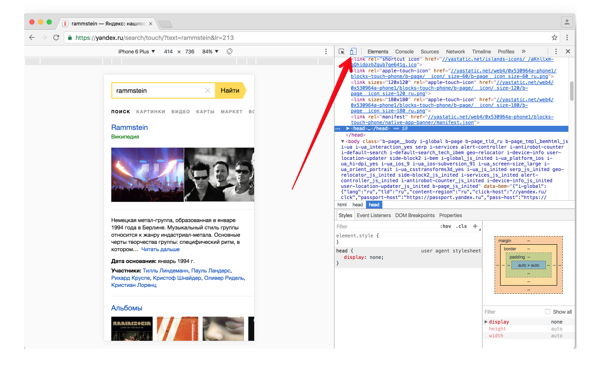

## Chromium
{:.screen-shot}

  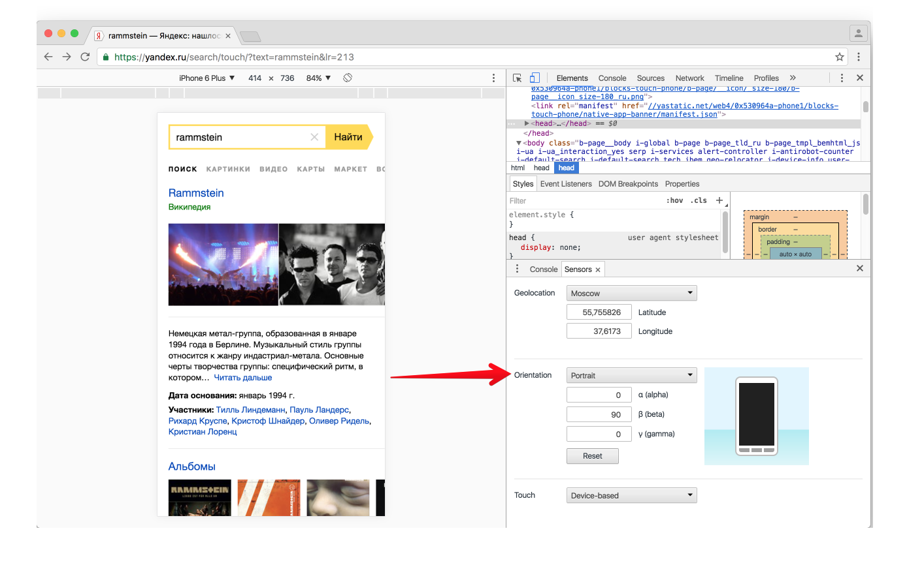

## MS Edge
{:.screen-shot}

  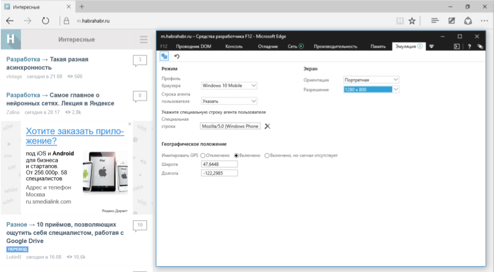

## Firefox
{:.screen-shot}

  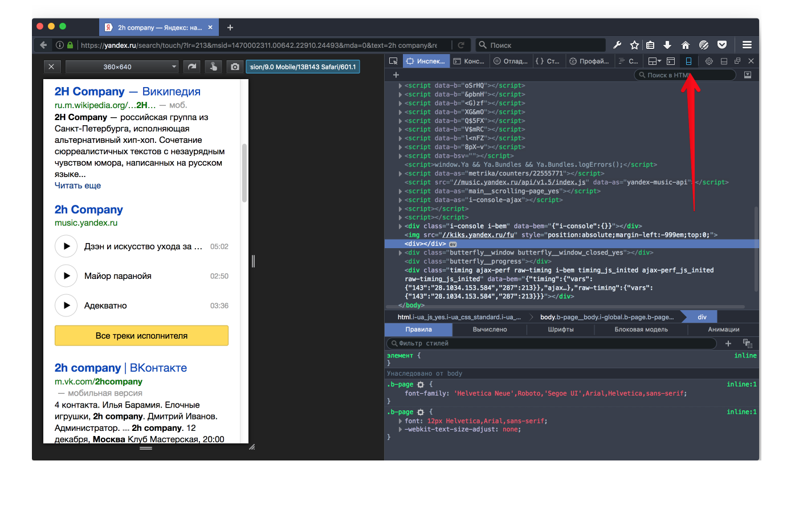

## &nbsp;
{:.section}

### Как пробросить проект в устройство?

## Варианты

  * Открыть напрямую: `http://192.168.1.100`
  * Туннелирование:
    * localtunnel
    * ngrok
    * SSH туннель

## Открыть напрямую

## Туннелирование

## localtunnel

[github.com/localtunnel/localtunnel](https://github.com/localtunnel/localtunnel)

&nbsp;
&nbsp;

  * `npm install localtunnel`
  * `lt --port 8487`
  * Получаем URL в Интернете: `http://ipnhrxfvkt.localtunnel.me`

## ngrok

[ngrok.com](https://ngrok.com/)

&nbsp;
&nbsp;

  * Скачать, распаковать
  * `ngrok http 8487`
  * Получаем URL в Интернете:
    * `http://a3c04d5b.ngrok.io`
    * `https://a3c04d5b.ngrok.io`

## SSH туннель

На UNIX-like системах присутствует по умолчанию

  * `ssh -N -R 8487:localhost:8487 my-server.me`
  * Открываем `my-server.me:8487`

В Windows можно воспользоваться PuTTY

## &nbsp;
{:.section}

### Как пробраться в мобильный браузер?

## Как пробраться в мобильный браузер?
{:.section}

### Отладка по USB

## Отладка по USB

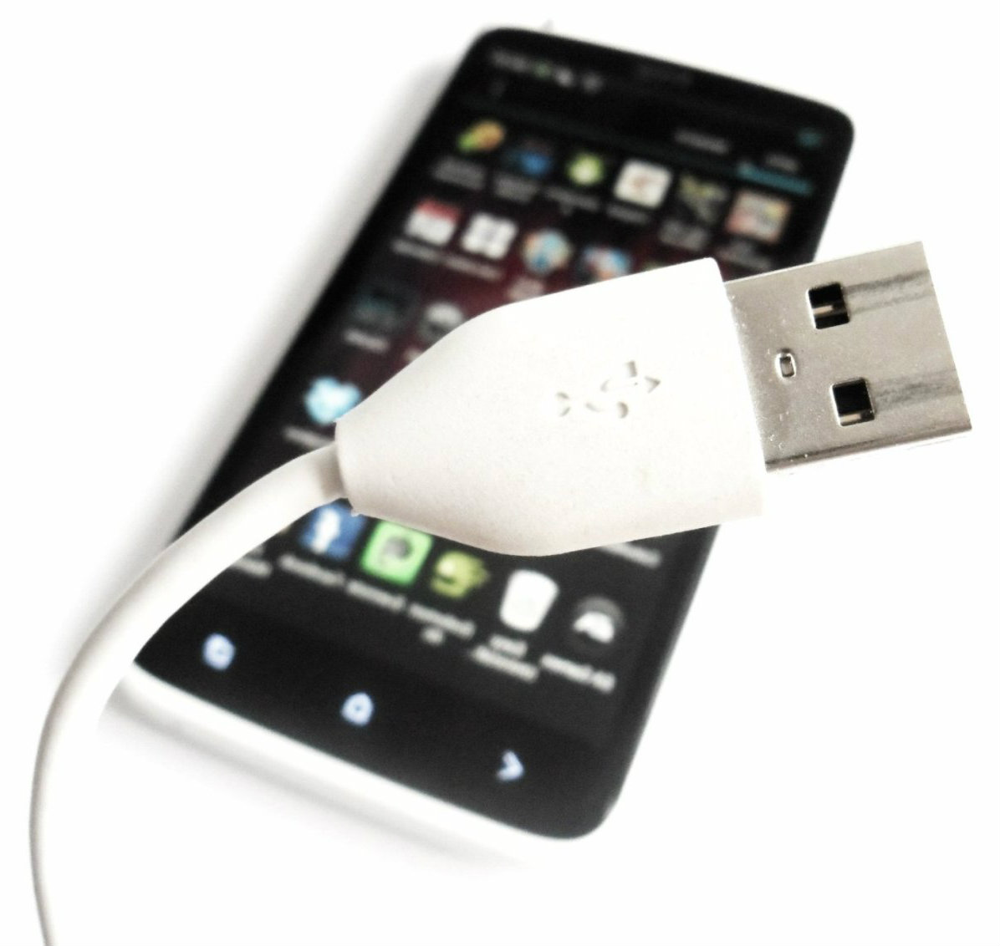{:.right-image}

  * Chromium
  * Safari
  * Firefox

## Chromium
{:.screen-shot}

  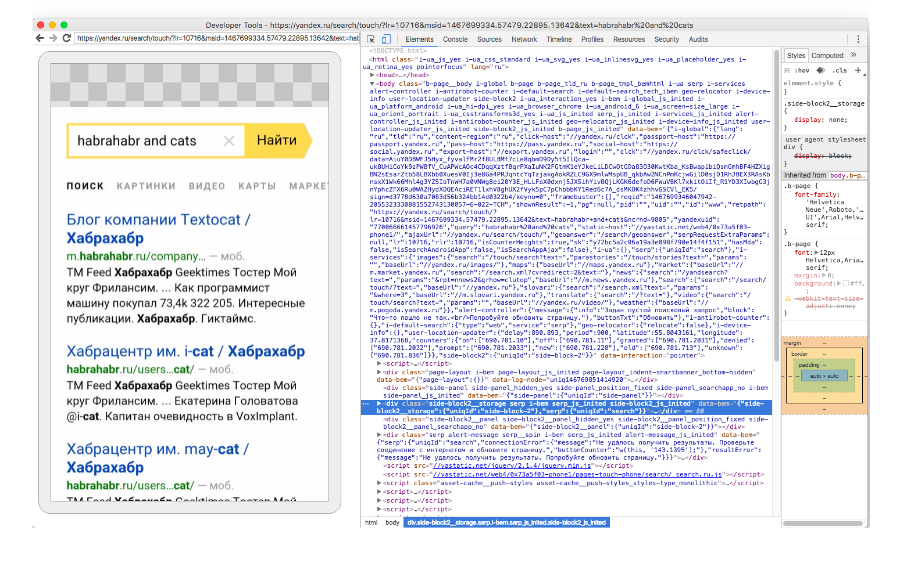

## Safari
{:.screen-shot}

  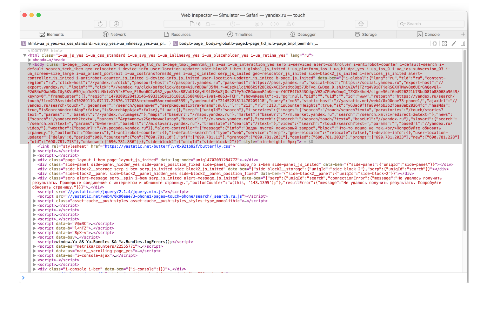

## Минусы

Хорошо и везде работает отладка Android 4.4+ в Chromium

Хорошо на macOS работает отладка iOS 6+ в Safari

А другие сочетания?

...Неплохо работает отладка Firefox, но это нечасто нужно

## ios-webkit-debug-proxy

Позволяет отлаживать iOS в Chromium

&nbsp;
&nbsp;

Проект:

  * MaxOS, Linux: [ios-webkit-debug-proxy](https://github.com/google/ios-webkit-debug-proxy)
  * Windows: [ios-webkit-debug-proxy-win32](https://github.com/artygus/ios-webkit-debug-proxy-win32)

## Как пробраться в мобильный браузер?
{:.section}

### Встраиваемые отладчики

## Встраиваемые отладчики

  * Vorlon.JS
  * weinre
  * Firebug light

## Vorlon.JS

[github.com/MicrosoftDX/Vorlonjs](https://github.com/MicrosoftDX/Vorlonjs)

&nbsp;
&nbsp;

Установить, запустить:

~~~
$ npm install vorlon
$ vorlon
~~~

Подключить к странице:

~~~

~~~

## Vorlon.JS с туннелем

~~~
$ lt --port 1337
~~~

~~~
http://quahpivgsm.localtunnel.me/vorlon.js
~~~

## Vorlon.JS
{:.screen-shot}

  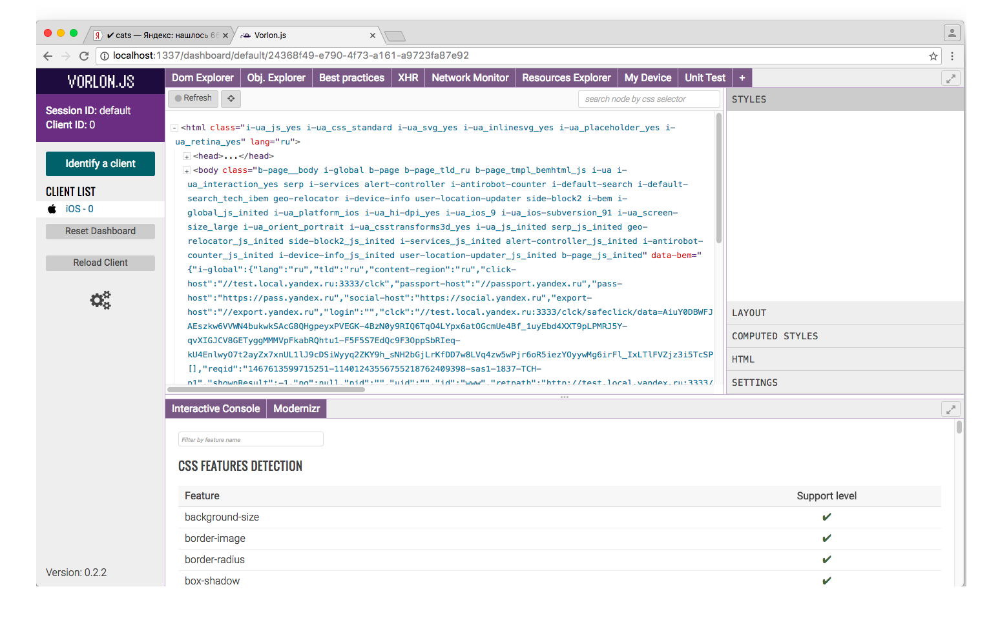

## Vorlon.JS

Интересные фичи:

  * DOM Explorer
  * Network Monitoring
  * Resource Explorer
  * My Device
  * Плагины

## Vorlon.JS
{:.screen-shot}

  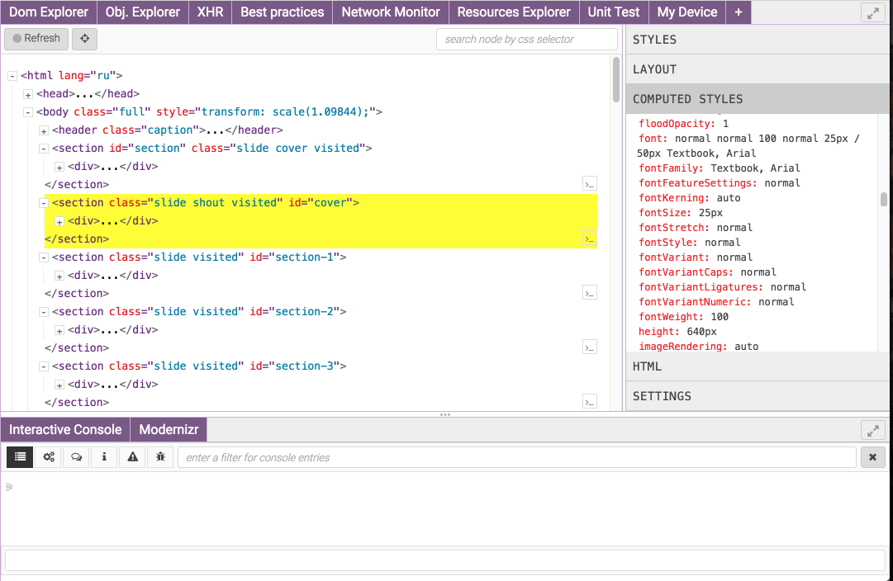

## Vorlon.JS
{:.screen-shot}

  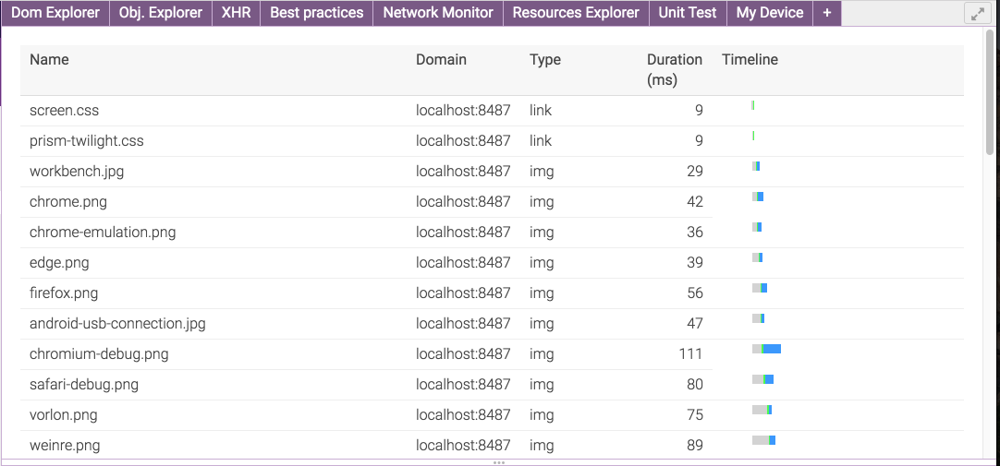

## Vorlon.JS
{:.screen-shot}

  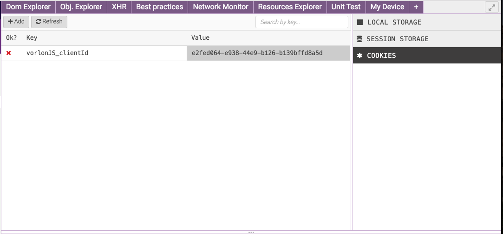

## Vorlon.JS
{:.screen-shot}

  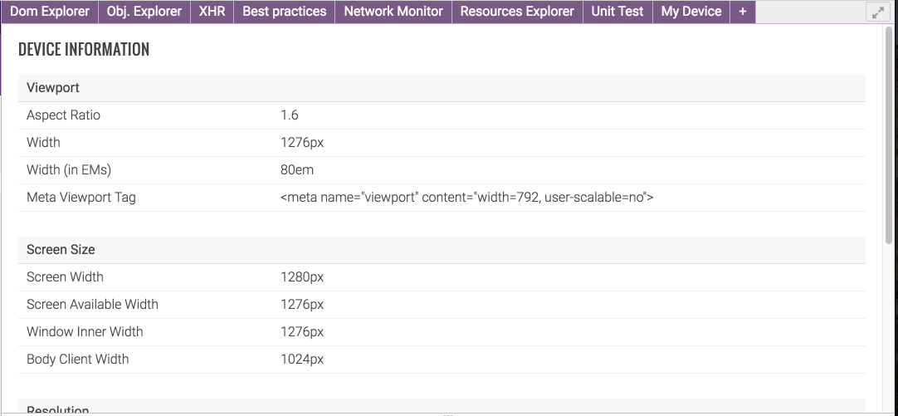

## Vorlon.JS

Расширяем: [www.vorlonjs.io/plugins](http://www.vorlonjs.io/plugins/)

## Vorlon.JS
{:.screen-shot}

  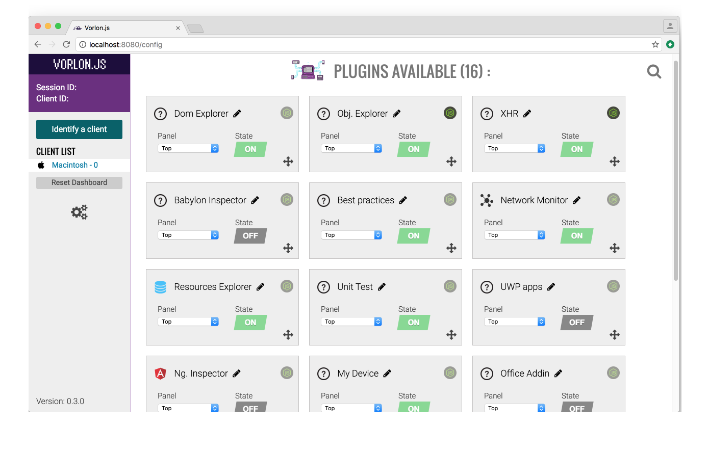

## weinre

[people.apache.org/~pmuellr/weinre](http://people.apache.org/~pmuellr/weinre)

&nbsp;
&nbsp;

~~~
$ npm install weinre
$ weinre
$ lt --port 8080
~~~

~~~

~~~

## weinre
{:.screen-shot}

  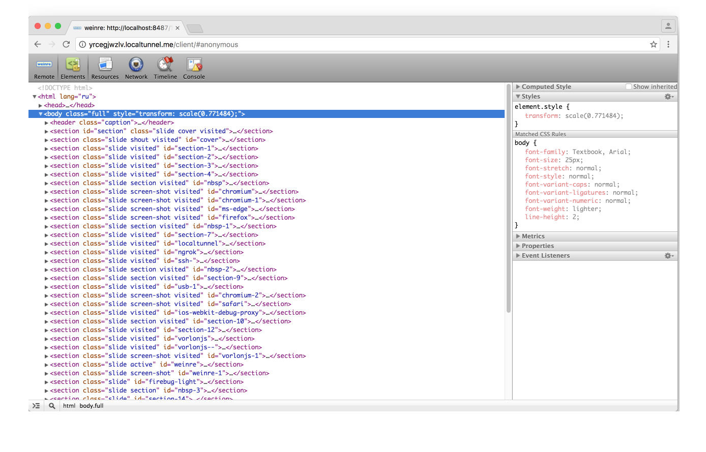

## Firebug light

[getfirebug.com/firebuglite](http://getfirebug.com/firebuglite)

&nbsp;
&nbsp;

~~~

~~~

## Firebug light
{:.screen-shot}

  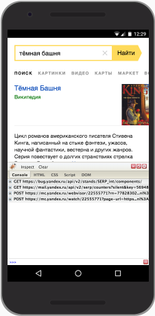

## &nbsp;
{:.section}

### Что, если нужно устройство, но его не найти?

## Эмуляторы

<table style="text-align: center">
  <tr style="padding: 10px !important">
    <td>Android</td>
    <td>iOS</td>
    <td>Windows Phone</td>
  </tr>
  <tr style="padding: 10px !important">
    <td style="vertical-align: middle">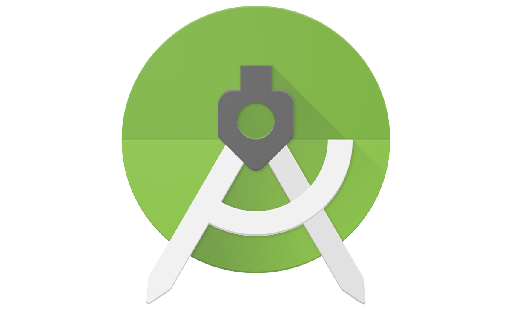</td>
    <td style="vertical-align: middle">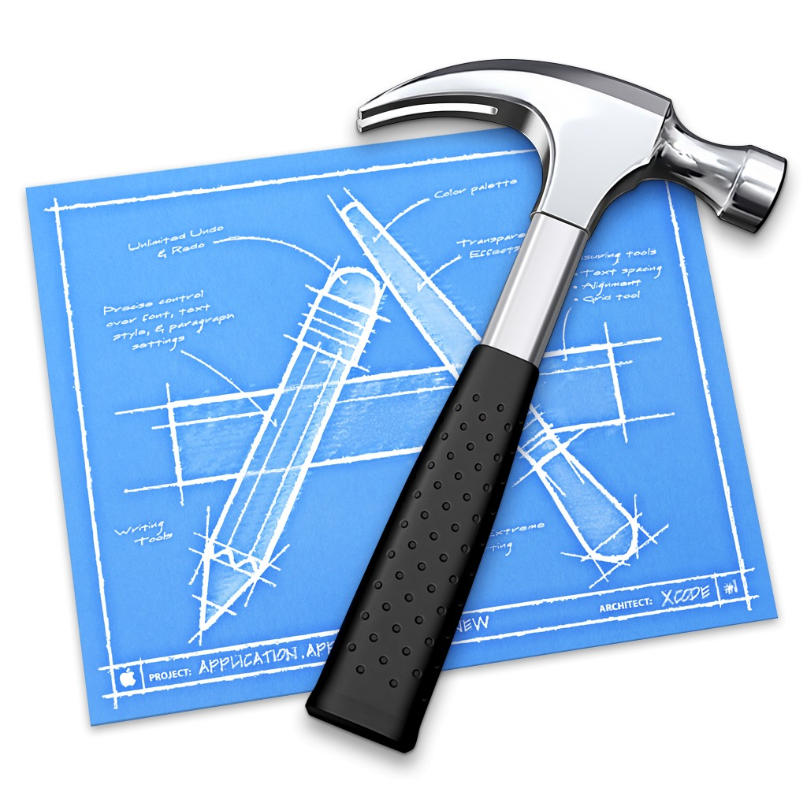</td>
    <td style="vertical-align: middle">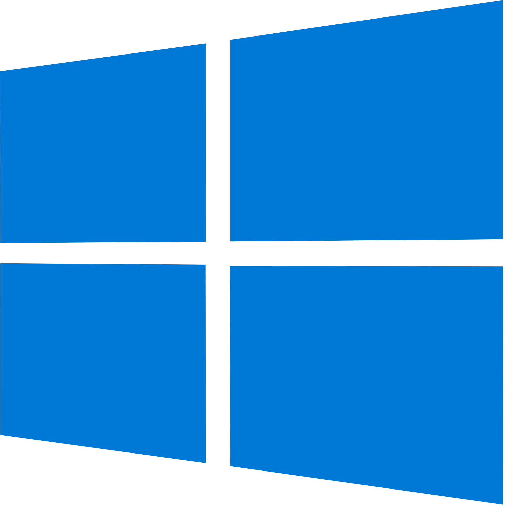</td>
  </tr>
  <tr style="padding: 10px !important">
    <td>Android Studio</td>
    <td>XCode</td>
    <td>Windows Phone emulator</td>
  </tr>
</table>

## BrowserStack

[browserstack.com](https://www.browserstack.com)

&nbsp;
&nbsp;

Тестирование в реальных браузерах

&nbsp;
&nbsp;

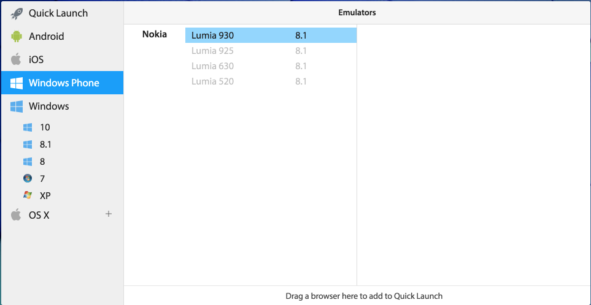

## BrowserStack
{:.screen-shot}

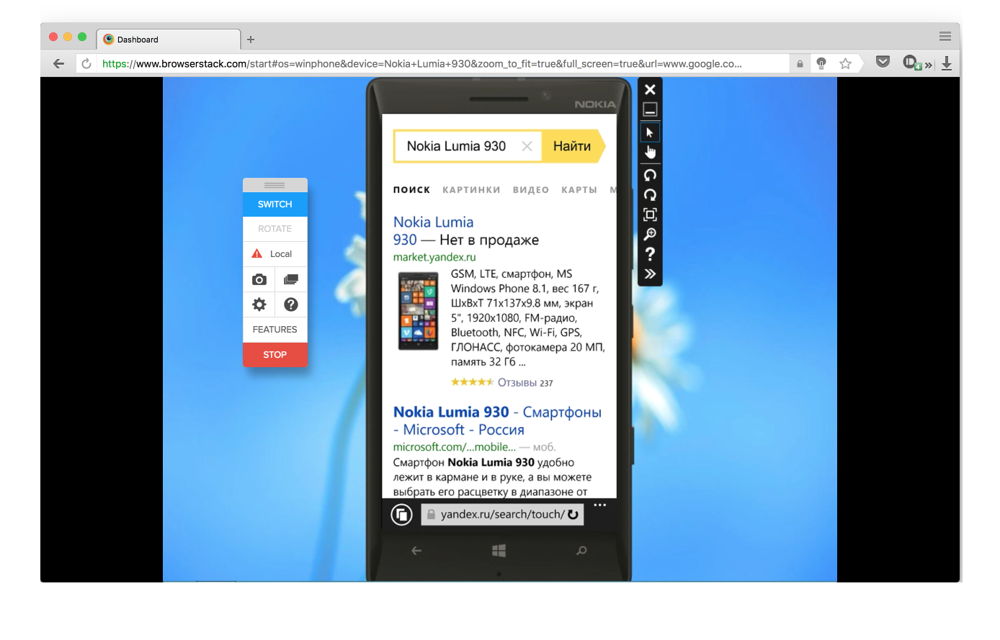

## Smartphone Test Farm

[github.com/openstf/stf](https://github.com/openstf/stf)

&nbsp;
&nbsp;

Удалённое тестирование в устройствах

«Свой BrowserStack»

## Smartphone Test Farm
{:.screen-shot}

  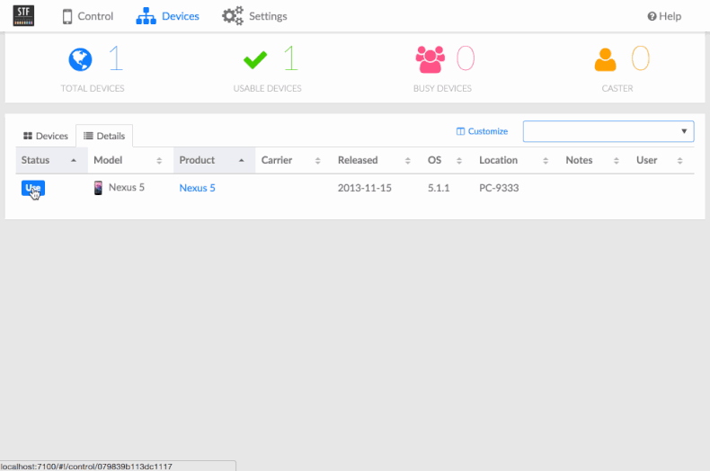

## &nbsp;
{:.section}

### Заключение

## Проблемы и решения

<table>
  <tr>
    <td>Как разрабатывать без мобильного?</td>
    <td>Инструменты браузеров</td>
  </tr>
  <tr>
    <td>Как пробросить проект в устройство?</td>
    <td>localtunnel, ngrok, SSH</td>
  </tr>
  <tr>
    <td>Как пробраться в мобильный браузер?</td>
    <td>USB-отладка, Vorlon.JS, Firebug light</td>
  </tr>
  <tr>
    <td>Что, если нужно устройство, но его не найти?</td>
    <td>Эмуляторы, BrowserStack</td>
  </tr>
</table>

## &nbsp;
{:.section}

### Спасибо за внимание!
